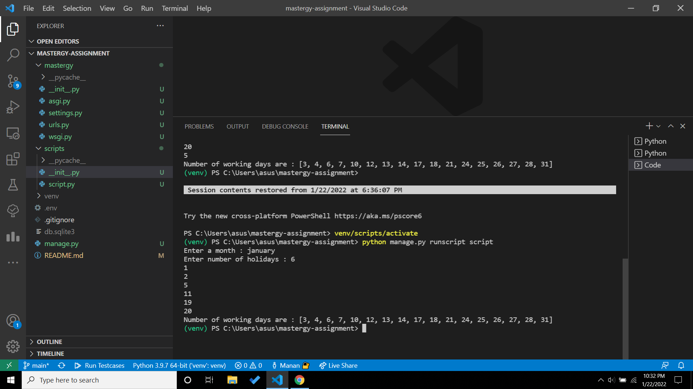

# Mastergy Assignment

## Question :
Write a working script using Python Django.The program must return the working days of any month of 2022 by excluding the weekends and custom holidays.The month and the holidays should be given by the user.

```
Example:
    User Input: January
    Holidays: 1,2,5,11,19,20
    Workingdays: 3,4,6​,7,10,12,13,14,17,18,20,21,24,25,26,27,28, 31
```
## Solution : 
The required solution is in scripts/script.py file.

## How to run 
1. Clone the repo to your local system

    ```git clone https://github.com/manan2110/MedGuide.git ```
2. Create a virtual environment. You can use this [link](https://docs.python.org/3/library/venv.html) for reference.

    ``` python -m venv venv ```
3. Activate your virtual environment using : 
    
    ```venv/Scripts/activate``` 
    
    Here venv is the name of virtual environment.

4. Install all the requirements required to run the project : 
    
    ```pip install -r requirements.txt```

5. create a file with name ```.env``` and add the following credentials 
    ``` 
    SECRET_KEY = .....
    DEBUG = ....
    ```
6. To run the script use the command :
    ```python manage.py runscript script```

7. Enter the month, followed by number of holidays and the dates of holidays.

## Output :

